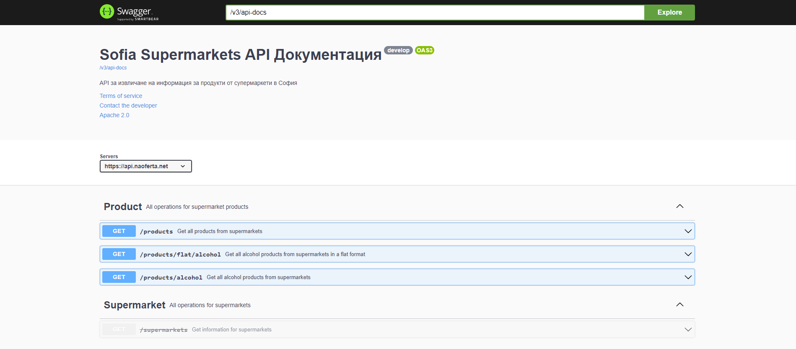

# sofia-supermarkets-api
An API to retrieve products information from supermarkets in Sofia

## Supported supermarkets

- [x] Billa
> Gets product information from https://ssbbilla.site/. Images are retrieved based on the first result in google image search.
- [x] Fantastico
> Downloads the pdf brochures available on https://www.fantastico.bg/special-offers and parses the product information from them. Images are retrieved based on the first result in google image search.
- [x] Kaufland
> Gets product information from https://www.kaufland.bg/.
- [x] Lidl
> Gets product information from https://www.lidl.bg/.
- [x] T-Market
> Gets product information from https://tmarketonline.bg/.
- [ ] METRO
- [ ] Kam Market
- [ ] CBA
- [ ] ProMarket
- [ ] Hit Max

## Tech Stack
* Kotlin
* Gradle  
* Spring Boot

## Running Locally
Install JDK 15 or above from [here](https://jdk.java.net/)
* **Unix** `./gradlew bootRun`
* **Windows** `gradlew.bat bootRun`

The following environment variables need to be set prior to running
* DB_USERNAME
* DB_PASSWORD
* GOOGLE_API_KEY
* CLOUDINARY_API_SECRET

Navigate to <http://localhost:8080/swagger-ui/> to check the API documentation and test the endpoints

